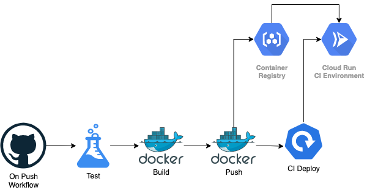

# pex
Python EXample Project

## Overview

This is an excuse to write some python and play with some fun tech.

* Dockerised service written in python using flask.
* CI Pipeline which triggers on push to master branch
* Pipeline pushes to the CI environment


## Architecture

Continuous Integration Architecture




## Processes

List of the processes used.

| Requirement       | Tech or Process                                              |
| ----------------- | ------------------------------------------------------------ |
| Development Model | [Acceptence Test Driven Development](https://en.wikipedia.org/wiki/Acceptance_test%E2%80%93driven_development) |
| Branching Model   | [Trunk Based Development](https://trunkbaseddevelopment.com/) |
| Integration Model | [Continuous Integration](https://www.thoughtworks.com/continuous-integration) |
| Versioning        | [Semantic Versioning](https://semver.org/)                   |


## Technologies

List of the technologies used.

| Requirement                 | Tech or Process                                              |
| --------------------------- | ------------------------------------------------------------ |
| Language                    | [Python](https://www.python.org/)                            |
| Language Version Management | [pyenv](https://github.com/pyenv/pyenv)                      |
| Linters                     | [pylint](https://www.pylint.org/) [flake8](https://flake8.pycqa.org/en/latest/) [bandit](https://bandit.readthedocs.io/en/latest/) |
| Formatter                   | [Black](https://github.com/psf/black)                        |
| Web Framework               | [Flask](https://flask.palletsprojects.com/en/1.1.x/)         |
| Web Server                  | [Gunicorn](https://gunicorn.org/)                            |
| Testing Framework           | [pytest](https://docs.pytest.org/en/stable/) [pytest-sugar](https://github.com/Teemu/pytest-sugar/) |
| SCM                         | [Github](https://github.com/)                                |
| Dependency Management       | [Poetry](https://python-poetry.org/)                         |
| Packaging                   | [Docker](https://www.docker.com/)                            |
| Container OS                | [python:3.9.1-alpine3.13](https://hub.docker.com/layers/python/library/python/3.9.1-alpine3.13/images/sha256-d67bb897163cd15791acae189ba1bacef82017b4d2d0c36623f55a3eb0c8e989?context=explore) |
| Versioning                  | [bump2version](https://pypi.org/project/bump2version/)       |
| Pre-Commit Pipeline         | [pre-commit](https://pre-commit.com/)                        |
| CI Pipeline                 | [Github Actions](https://github.com/features/actions)        |
| CI Environment              | [Google Cloud Run](https://cloud.google.com/run)             |


## Development

Before starting development you will need to configure your environment.  Once thats is done, follow the development workflow.


### Configure Development Environment

This is an example of Mac OS X.  If you need to configure one of the other environments, you can.  Or just sell a kidney and buy a Mac... your choice.

1. Install Docker - https://docs.docker.com/get-docker/

2. Install an editor - https://code.visualstudio.com/

3. Install homebrew - https://brew.sh/

4. Install homebrew packages

   ```
   brew update && brew install git pyenv pipx poetry ; brew upgrade git pyenv pipx poetry
   ```

5. Add the following to `.zshrc` for pyenv

   ```
   eval "$(pyenv init -)"
   ```

6. Add the following to you `.zshrc` for pipx

   ```
   export PATH="$PATH:${HOME}/.local/bin"
   ```

7. Install pre-commit using pipx

   ```
   pipx install pre-commit && pipx upgrade pre-commit
   ```

8. Install bump2version using pipx

   ```
   pipx install bump2version && pipx upgrade bump2version
   ```

9. Clone repository

   ```
   git clone git@github.com:jamiemoore/pex.git && cd pex
   ```

10. Install the pre-commit hook

   ```
   pre-commit install
   ```

11. Configure the python virtual environment

    ```
    poetry env use 3.9.1
    poetry install
    ```

12. Launch editor

    ```
    code .
    ```

13. Select the appropriate virtual environment in your editor

14. Run future commands in your terminal editor which will activate the correct pthon environment

15. You are now ready for the development workflow


### Development and CI Workflow (DX)

The deployment process is descibed only to the the continuous integration environment.

1. Check out latest version of code

   ```
   git pull
   ```

2. Write tests for any acceptence criteria (ATDD)

3. Tests fail :(

   ```
   pytest
   ```

4. Develop (The magic happens here)

5. Tests pass :)

   ```
   pytest
   ```

6. Commit code (Please see the pre-commit hook)

   ```
   git commit -a -m "my new amazing feature"
   ```

7. Push code

   ```
   git push
   ```

8. Pipeline will now run and deploy to the CI environment

9. Check the pipeline here: https://github.com/jamiemoore/pex/actions

10. Check the CI environment here: https://pex-uhhaukwd6q-uc.a.run.app/

11. Remember your number one priority in TBD is to not break the build.  So make sure it is all good before moving onto the next story.

12. Fight the underpants gnomes for the profit.


### Testing

Tests can be run using the pytest command and tests can be found in the tests folder.

* Run tests

  ```
  pytest
  ```


## Pipeline

The pipeline is using github actions and does the following on a new commit.

* Run the pre-commit hooks
* Build the docker container
* Deploy to the CI Environment


## Pre-commit hook

There is a pre-commit hook configured for this project that will:

* Check for security issues such as aws creds and private keys
* Remove trailing whitespace and bad line endings
* Check for python debug statements
* Check for large files
* Check for merge conflicts
* Check listing using
  * pylint
  * flake8
  * bandit
* Check Formatting using black
* and run the tests

Install the git hook with

```
pre-commit install
```

If the above passes when you try to commit you will be able to commit.  If you would like to run the command manually

```
pre-commit run --all-files
```


## Versioning and Releasing

We are using Simantec Versioning and the tool bumpversion.  Bumpversion allows us to modify the version text in different files, add a git tag and commit the changes.  Once that is done we push the changes including the tag.


* Bump the version (minor) i.e. 0.1.0

  ```
  bumpversion [minor|minor|patch]
  ```

* Push the changes once you have bumped the version and added the tag

  ```
  git push && git push --tags
  ```

* When you push the tag it will run a github workflow to add a tag to the docker image with the version number.  This will be the start of a future release process.


**Additional Commands**

* Check the git tags

  ```
  git tag
  ```

* If you want to bump the version even though the git working directory is dirty, not usually a good idea

  ```
  bumpversion minor --allow-dirty
  ```

* Check your repo is not dirty

  ```
  git status
  ```


## Initial project setup

The initial repo setup only needs to be done once, but handy for reference.

1. Specify python version

   ```
   pyenv local 3.9.1
   ```

2. Init poetry

   ```
   poetry init
   poetry env use 3.9.1
   ```

3. Add deps

   ```
   poetry init
   poetry add -D poetry add -D pytest pytest-sugar pylint flake8 bandit black
   poetry add flask gunicorn
   ```


4. Configure Google Cloud Run for the pipeline.  Best practice is to not include this in the pipeline.

   ```
   gcloud run services add-iam-policy-binding pex --member="allUsers" --role="roles/run.invoker" --platform managed --region us-central1
   ```


## Packaging

Packaging is done using docker.  It is automated in the pipeline but if you wish to build or run the image manually you can use the following commands.

* Build docker image with a version

  ```
  docker build -t pex:$(cat VERSION) --build-arg COMMIT_SHA=$(git rev-parse --short HEAD) .
  ```

* Build docker image with a short sha

  ```
  docker build -t pex:$(git rev-parse --short HEAD) --build-arg COMMIT_SHA=$(git rev-parse --short HEAD) .
  ```

* Run the container

  ```
  docker run --rm -p 8080:4040 pex:$(cat VERSION)
  ```

* Debug container

  ```
  docker run --rm -it -p 8080:80 pex:$(cat VERSION) /bin/sh
  ```


## Risks

* Deployment is a CI deployment and should not be used for production for the following reason
  * No monitoring and alerting
  * No health checks and auto healing
  * No automated scaling or elasticity
* TBD is almost always a good practice for a single developer but as teams get bigger Github Flow may be a better fit.
* There are no unit tests as I wanted to explain my opinionated view on ATDD over TDD, however this is not always the correct choice and depends on what is trying to be acheived. In some cases a lack of unit tests could be considered a risk.  "Only a Sith deals in absolutes".
* No non-functional tests (performance/security)
* No integration tests, not really required in this example... but could be something for the future.
* No release process as it is outside the scope, though I have started the process by tagging the docker image with the version number.


## Notes

* https://testdriven.io/blog/flask-pytest/
* https://github.com/actions/starter-workflows/blob/main/ci/google.yml
* https://github.com/marketplace?type=actions
* https://github.com/marketplace/actions/deploy-to-cloud-run